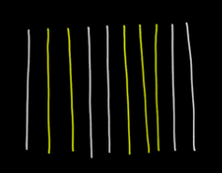
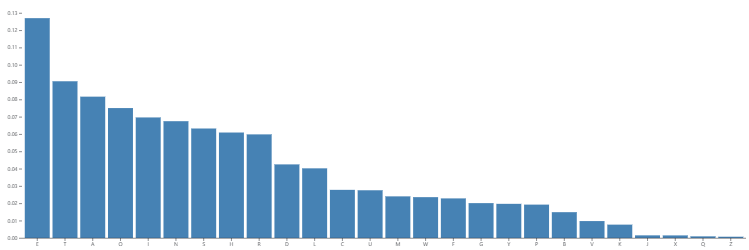
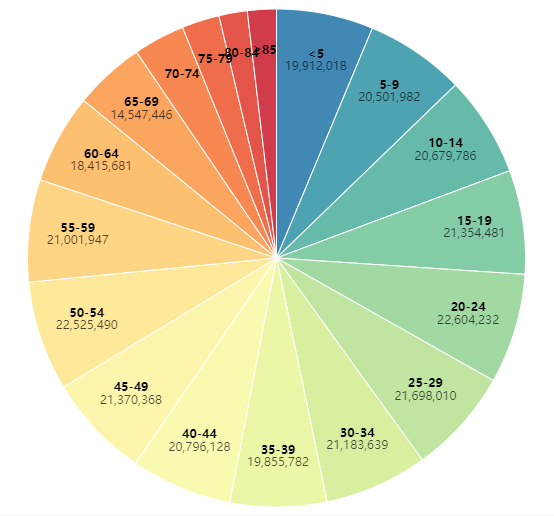
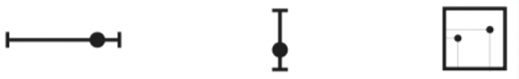
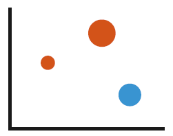

# 数据可视化导论小测

参考：

[数据可视化选择题](https://blog.csdn.net/weixin_48931875/article/details/125251249)

[可视化导论（浙大）中国大学MOOC慕课 章节测验期末考试客观题答案](https://max.book118.com/html/2022/0816/8046064022004130.shtm)

[可视化导论 MOOC](https://www.icourse163.org/course/ZJU-1206452826)

## 第一次 L1~L4

1. 有的人在发朋友圈的时候，会把一张图片切成9份，然后再按顺序拼出一个九宫格，如下图所示。虽然图片被分割开来，但是我们仍旧能够感知到图片原来完整的样子，这体现了格式塔理论的（ ）原则。
   

   单选题 (10 分) 10分

   A. 相似原则

   ***B. 连续原则***

   C. 接近原则

   D. 闭包原则

   正确答案: B

2. 下图所示的图片体现了格式塔理论的（ ）原则

   
   单选题 (10 分) 10分

   A. 相似原则

   B. 闭包原则

   C. 连续原则

   ***D. 接近原则***

   正确答案: D

3. 下图所示的图片体现了格式塔理论的（ ）原则。

   
   单选题 (10 分) 10分

   A. 连续原则

   B. 接近原则

   C. 闭包原则

   ***D. 相似原则***

   正确答案: D

4. 下图所示的可视化中运用了以下哪个视觉通道？

   
   单选题 (10 分) 10分

   A. 颜色

   B. 亮度

   ***C. 高度***

   D. 形状

   正确答案: C

5. 下图所示的可视化中体现了哪种类型的视觉通道？

   
   单选题 (10 分) 10分

   ***A. 分组型***

   B. 分类型

   C. 定性型

   D. 定量型

   正确答案: A

6. 根据格式塔理论，人们在观看时，眼脑在一开始的时候会先区分一个形象的各个单一的组成部分，然后再将各个部分组合起来，使之成为一个易于理解的统一体。

   
   判断题 (10 分) 10分

   A. 正确

   ***B. 错误***

   正确答案: B

7. 形状是一种典型的定性视觉通道。判断题 (10 分) 10分

   A. 错误

   ***B. 正确***

   正确答案: B

8. 下列视觉通道中，哪些是定性/分类视觉通道？多选题 (10 分) 10分

   ***A. 形状***

   B. 颜色的饱和度

   C. 角度

   ***D. 空间位置***

   正确答案: A D

9. 下图所示的可视化中运用了哪些视觉通道？

   
   多选题 (10 分) 10分

   ***A. 颜色色调***

   B. 形状

   ***C. 角度***

   D. 空间位置

   正确答案: A C

10. 以下关于感知与认知的一些描述，正确的有哪些？多选题 (10 分) 10分

***A. 认知是信息加工的过程***

***B. 在可视化中突出变化，可以减少认知负担***

C. 感知系统基于绝对判断

***D. 可视化可以作为外部辅助来增强工作记忆***

正确答案: A B D

## 第二次 L6

1. (C) 以下哪种Vega-Lite的交互类型能够重用代码生成相同的图表

   单选题 (10 分) 10分

   A. Facet

   B. Layer

   ***C. Repeat***

   D. Concatenation

2. (D)可视化和其他数据分析处理方法最大的不同是用户起到了关键作用，可视化映射后的结果只有通过（）才能转换成知识和灵感（单选2分）

   单选题 (10 分) 10分

   A. 以上答案均不正确

   B. 数据处理与变换

   C. 可视化映射

   ***D. 用户感知***

3. (A)以下哪种属于交互式可视化工具

   单选题 (10 分) 10分

   ***A. Gephi***

   B. D3

   C. Processing

   D. Vega-Lite

4. (D)以下哪个不是D3的特点

   单选题 (10 分) 10分

   A. 能够支持缩放平移等交互

   B. 诞生于斯坦福大学

   C. 核心思想是数据和可视化元素的绑定

   ***D. 使用Java进行编程***

5. (C)OpenGL的全称是

   单选题 (10 分) 10分

   A. Open Graphics Language

   B. Open Graph Language

   ***C. Open Graphics Library***

   D. Open Graph Library

6. (ACD) 以下哪些属于编程式可视化工具

   多选题 (10 分) 10分

   ***A. D3***

   B. Tableau

   ***C. WebGL***

   ***D. OpenGL***

7. (ABCD)以下哪些是Vega Lite定义的视图组合操作

   多选题 (10 分) 10分

   ***A. Facet***

   ***B. Layer***

   ***C. Concatenation***

   ***D. Repeat***

8. (ABCD)以下的哪些属于WebGL的特点

   多选题 (10 分) 10分

   ***A. 可以使用JavaScript调用***

   ***B. 可以调用底层硬件对canvas进行加速***

   ***C. 编程复杂***

   ***D. 可拓展性强***

9. (B)交互式工具比配置式工具更需要用户有一定的编程技巧

   判断题 (10 分) 10分

   A. 正确

   **B. 错误**

10. (B)编程式可视化工具不适合用来做复杂的可视化任务

    判断题 (10 分) 10分

A. 正确

**B. 错误**

## 第三次 L6~L7

1. ( **A** )以下哪个视觉通道是位置通道（单选2 分）

   单选题 (10 分) 10分

   **A.**

   

   B.

   

   C.

   

   D.

   

2. (  **C**  )下面哪个选项不是表达维度的展现方式

   单选题 (10 分) 10分

   

   A. 螺旋形

   B.径向

   **C.次序**

   D.线性

   

3. (  **B**  )下列哪一个不属于可视化三部曲

   单选题 (10 分) 10分

   A.视图与交互设计

   **B.可视化代码实现**

   C.可展示数据筛选

   D.可视化编码映射

4. (  **B**  )过滤是在那个空间中进行的交互？

   单选题 (10 分) 10分

   A.屏幕空间

   **B.数据值空间**

   C.可视化参数空间

   D.数据结构空间

5. (  **B**  )我们在为可视化系统设计交互时，（ ）

   单选题 (10 分) 10分

   A.为了节省实现成本，提供最容易实现的交互

   **B.为了防止交互之间产生冲突，应结合用户需要，提供必要的交互**

   C.为了降低用户的学习成本，提供使用起来最简单的交互即可

   D.为了使系统便于使用，提供越多交互越好

6. (  **ABD**  )颜色的视觉通道包括

   多选题 (10 分) 10分

   **A.饱和度**

   **B.透明度**

   C.美观度

   **D.色相/色调**

7. (  **ABE**  )下图这个简单的可视化图表运用到了那几个视觉通道

   多选题 (10 分) 10分

   **A.位置**

   **B.颜色**

   C.纹理

   D.形状

   **E.尺寸**

8. (  **BD**  )在数据量很大的情况下，可以使用哪种交互模型来优化可视化系统？

   多选题 (10 分) 10分

   A.混合交互方式

   **B.聚焦+上下文模型**

   C.对偶界面模型

   **D.概览+细节模型**

9. (  **B**  )视觉通道就是图像中的基本几何元素

   判断题 (10 分) 10分

   A.正确

   **B.错误**

10. (  **B**  )在对可展示的数据进行筛选时，要确保不能展示过多数据，同时也不能展示过少数据

    判断题 (10 分) 10分

    A.错误
    
    **B.正确**

