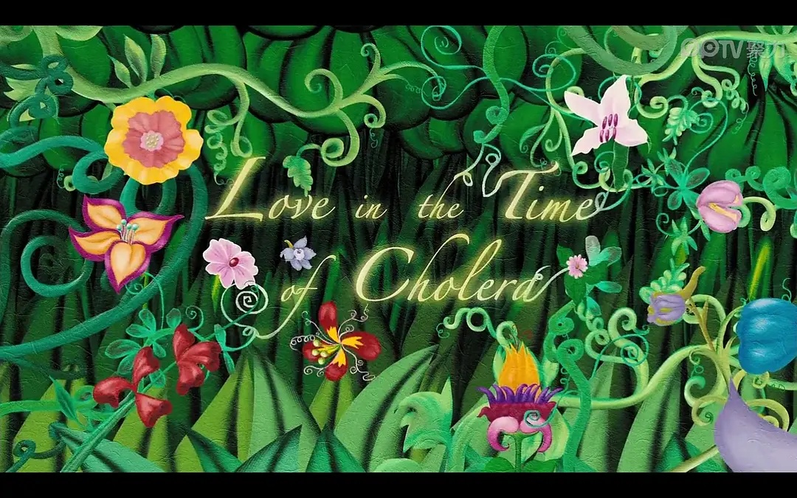
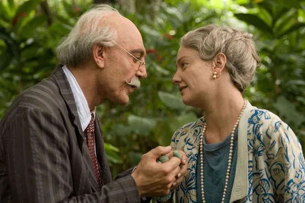

# 《霍乱时期的爱情》的美感溯源

> RitzzzZ 写于2021年秋（是某课程作业，别骂了

《霍乱时期的爱情》讲述了一场跨越半个多世纪的爱情故事，被誉为“人类有史以来最伟大的爱情小说”。本文将从距离之美，生命之美和隐喻之美三个角度，分析小说在何处给人带来深刻隽永的美的感受。

> 本文所有配图均来自豆瓣电影《霍乱时期的爱情》截图。

## 距离之美：魔幻与现实

朱光潜在《距离与美》中写道：“倒影是隔着一个世界的，是幻境，是与实际人生无直接关联的。我们一看到它，就注意到它的轮廓、线条和颜色，好比看一幅图画一样，这是形象的直觉，也是美感的体验。总而言之，正身和实际人生没有距离，倒影和实际人生有距离，美的差别即缘于此。”如果用纯粹理性的眼光考虑文学作品的现实合理性，那么文学中的美便荡然无存。如果文学完全与现实脱节，与人类根源的情感相背离，那么也无法激起如此普遍的灵魂共鸣与审美体验。

莫妮卡·曼索尔说，魔幻现实主义中，“现实主义”是主题方面的，而“魔幻”是语义方面的。[1]阿里萨对费尔明娜一见钟情，在许多人眼里是一时冲动，却绵延了半个多世纪；他们彼此遥远地相爱，费尔明娜却在重逢时忽然发觉往昔的爱慕不过是一场幻觉，残忍地拒绝了曾经深爱的恋人；阿里萨用尽一生等候，终于来到了这场爱情长跑的终点，与费尔明娜在海上永远航行下去，开启生命尽头的黄昏之恋。光怪陆离、动人心魄的故事，编织成一首跨越时空桎梏的爱情史诗，两人的爱情历经坎坷，跌宕起伏，最终画下一个气势磅礴、感人至深的句点。

而马尔克斯本人却不认为他所写的小说应被冠以“魔幻”之修饰词，他说：“在我的作品中，我从来也不曾寻求对那一切事件的任何解释，任何玄奥的解释。那一切不过是生活的一部分。所以当人们认为我的小说是‘魔幻现实主义’的表现时，这说明我们仍然受着笛卡尔哲学的影响，把拉丁美洲的日常世界和我们的文学之间的亲密联系抛在了一边。”[2]从“现实”这一角度看，《霍乱时期的爱情》中确实充满了直到如今依然为我们耳熟能详、津津乐道的现实场景：阿里萨因为身份卑微而被费尔明娜的父亲粗鲁地斥退；费尔明娜嫁给受人敬爱、颇具名望的乌尔比诺医生，过上了衣食无忧却世俗庸碌的家庭主妇生活，饱受丈夫家庭与生活琐事的折磨……小说折射了作者所观察到的生活现实，而不乏超乎常理之处；在扎根于现实的同时，依旧保持着与现实的距离。人们阅读时，发现小说中处处是生活的缩影，一场伟大爱情的坚守在这种有距离的真实之中呈现，愈加令人动容。

## 生命之美：灵魂与肉体

艺术起源的理论之一是“性欲的升华”。《霍乱时期的爱情》在“性”的话题上亦激起广泛争论。在书中，爱被一分为二，为“灵魂之爱”与“肉体之爱”。阿里萨穷尽一生追逐费尔明娜，我认为这里的爱兼具灵魂与肉体的双重属性。而他记满十几个笔记本的数百段“肉体之爱”，在某一瞬间也曾让他惊奇地感到，自己可能爱上其他女人。这种可怕的念头一闪而过，最终，他还是回到写入基因、刻入骨髓的对费尔明娜的执着与忠诚。可见灵魂与肉体并非简单的二元关系，将此二者截然对立地看待，即使能暂时满足生理或心理的需要，也是令人极度痛苦的。小说令我惊叹的地方之一便在于此——即便要忍受灵魂与肉体无法统一的巨大苦楚，阿里萨依然用尽一生、至死不渝地追求他心中唯一的挚爱。灵魂之爱和肉体之爱，在阿里萨七十多岁时才终于实现统一。

《霍乱时期的爱情》没有像一部纯粹的风流史那般，只给读者留下荒淫无度的印象；通篇读罢，我亦不觉阿里萨混乱的私生活与他对费尔明娜崇高、纯洁的爱相背离。性欲是人类正常的状态，是道德让它蒙上了羞耻，是拥护道德的人极力回避却无法避免的事实，是阿里萨的精神饱受爱情之苦时通过满足肉体需要而保持生命力的方式。在小说的结尾，船长的顿悟为这场不可战胜的爱情提供了一种生命角度的理解：“原来是生命，而非死亡，才是没有止境的。”

小说主线叙述的是爱情，但我认为更多的是对人类生命状态的思考，因为爱和生存在某种意义上是一致的，在视爱为生命终极意义的阿里萨身上更是如此。马尔克斯借助阿里萨这个形象，提出对人的“自我”的关怀，对道德伦理、灵肉关系以及爱之“忠贞”的传统语义发出挑战。阿里萨几十年中始终对费尔明娜保持着至死不渝的精神上的爱，但并不压制自身的肉欲。马尔克斯并未对阿里萨的行为进行价值层面的判断，他在《霍乱时期的爱情》中写道：“……爱是爱，肉欲是肉欲，灵魂之爱在腰部以上，肉体之爱在腰部以下。”这一叙述，让读者重审精神与身体的关系，反映了一种对生命本能的尊重。

由此，我联想到福柯提出的生存美学：“没有什么比压抑性欲更违反自然，从而更加有害。”生存美学的核心思想是“关怀自我”，即在肉体和灵魂上保持自由舒适，“以便创造、享受和鉴赏自身的生存审美快感，使自身成为真正独立自由和充满创造活力的审美生命”[3] 。随着现代思想的解放，人们逐渐开始正视自身的欲望，反思自己的生存状态；而只有抛开道德评判，在思维不受社会文化束缚的时候，我们才能进入真正自由、有效的思考。在不需要讨好社会道德习俗的文学作品中，阿里萨的背德、滥情并不招致来自公序良俗的道德批判。相反，在一个充斥着灾难与战争，精神与肉体双重痛苦的时代背景下，阿里萨对“保持处子之身”的承诺的打破，对个体生存状态所做出的选择，恰恰是一种对创造独立自由的“审美生命”的诠释。

## 隐喻之美：霍乱与爱情

小说的背景设置在霍乱大行其道之际，灾难、死亡和生存成为了时代无法避免的主题。课上讲到，艺术的另一种起源学说乃“生命苦难意识的呈现”。爱情是美好的，然而被所爱之人拒绝，眼见所爱之人嫁给他人，求而不得的痛苦也是真实的。如同命中注定般，阿里萨逃脱不了爱。阿里萨的父亲在去世前吐露了自己最真诚的心迹：“我对死亡感到的唯一痛苦是没能为爱而死。”阿里萨携带着同样的基因，他知道，即使爱情会带来永无止境的苦难，耗尽一生的精力与光阴，但他将始终如一地守候他所深爱的“戴王冠的公主”。

小说中多次描写阿里萨在思恋中如同得了霍乱般的表现：在阿里萨向威尔明娜吐露爱意之后的焦灼等待中，他呕吐发热，卧床不起；在久久得不到答复的日子里，对爱的渴望和求而不得的煎熬不断啃噬着阿里萨的心。爱情就像一场瘟疫，让卷入其中的人魂不守舍，无法自拔。马尔克斯在小说中以现实的病痛之苦，暗喻陷入爱情泥沼的人的思恋之苦，将对爱情的精神痛楚，引申至对生命苦难意识的体现。

但是，对苦难的呈现并非目的，而是展现人类美好秉性的一种手段。当人面对苦难，直面生存问题时，阿里萨所表现出的不屈服于灾难、不堕落于世俗的精神，超越了生命意识的三个功利性维度——自我意识、伦理意识、宗教意识，反映了一种从苦难中萌芽、在残酷的命运洗礼下蓬勃生长的审美意识，也是让读者感到小说人物本身所带来的美感的来源。

阿里萨的一生离不开“爱”这个字，但他也告诉我们：仅仅有爱，是行不通的。狂热的爱正如无法抵挡的洪水，但阿里萨并未在求爱不得的痛苦中颓靡沉沦，而是把爱情变成了强烈的内在动机，在对未来生活的憧憬与希望中不断超越自己。他兢兢业业，努力提升自己的职位与社会地位；替热恋中的人写情书，为受到伤害的人抚平伤痕。弗洛姆在《爱的艺术》中写道：“爱一个人就是要献出自己，而不期待得到回报，但相信自己的爱一定会唤起对方的爱……爱情是一项积极的活动；如果我爱，我对所爱之人就抱有积极的态度，而且还不限于对他（她）。”[4]毋庸置疑，阿里萨就是“爱的艺术”的实践者，是爱情的史诗中最英勇无畏、不可战胜的骑兵。甚至可以说，阿里萨本身已经成为文学艺术中最令人印象深刻的爱情的隐喻之一。

## 参考文献

[1]莫妮卡·曼索尔. 鲁尔福与魔幻现实主义.

[2]加西亚·马尔克斯. 马尔克斯谈风格和艺术创新[J]. 文艺理论研究,1989(1):97.

[3]米歇尔·福柯.词与物———人文科学考古学[M].莫伟民,译.上海:三联书店,2001.

[4]弗洛姆.爱的艺术.上海译文出版社.
