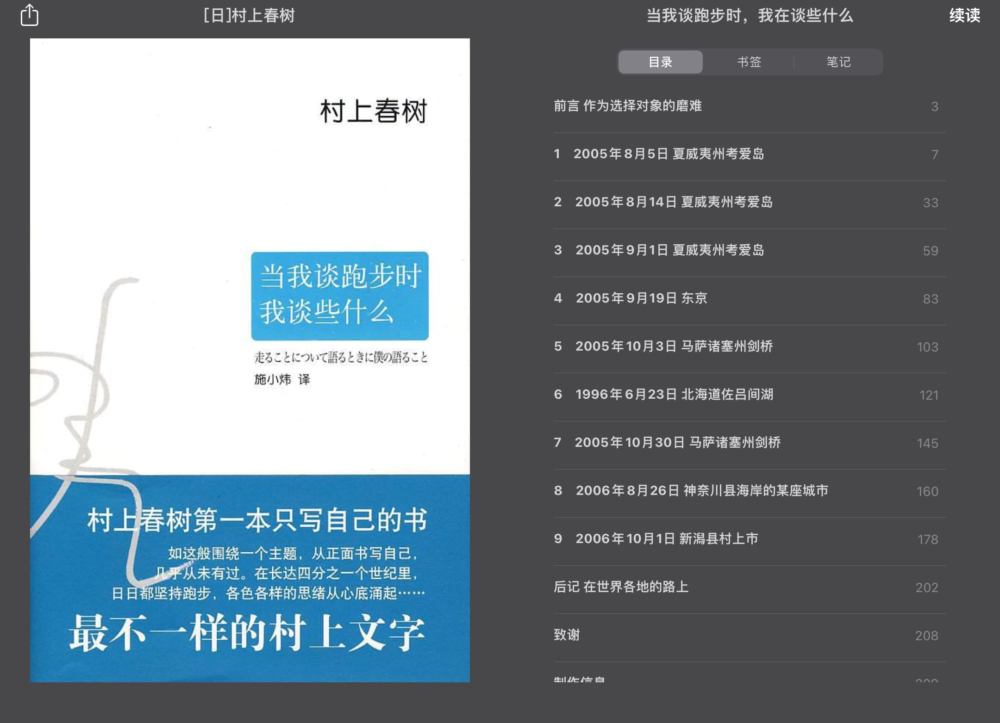
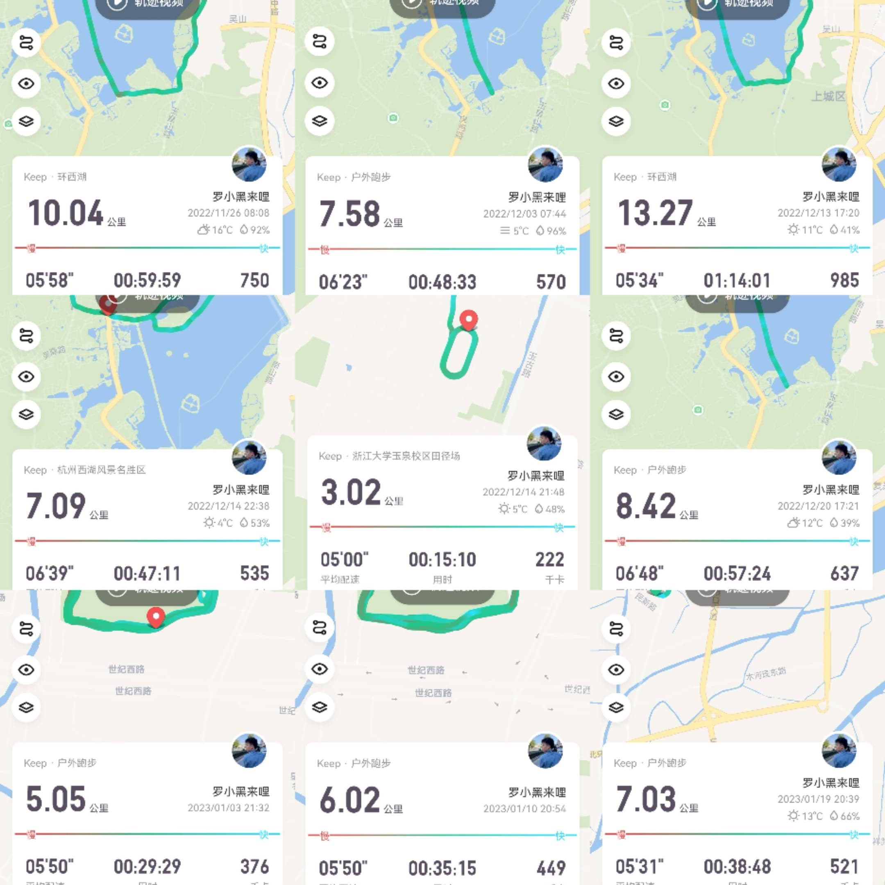
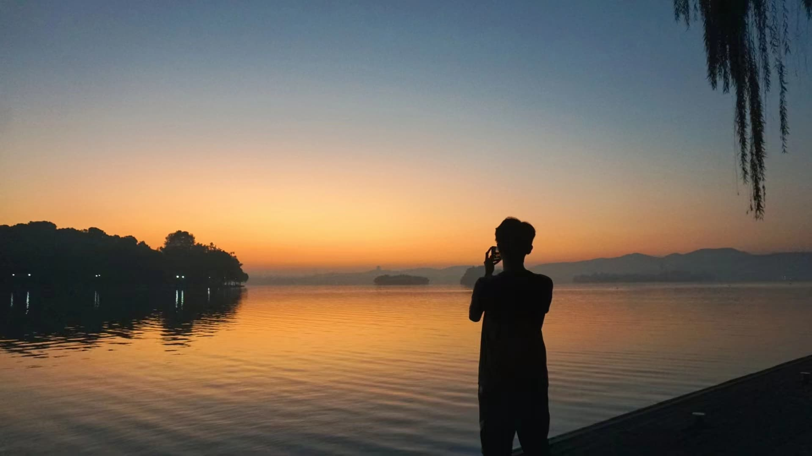
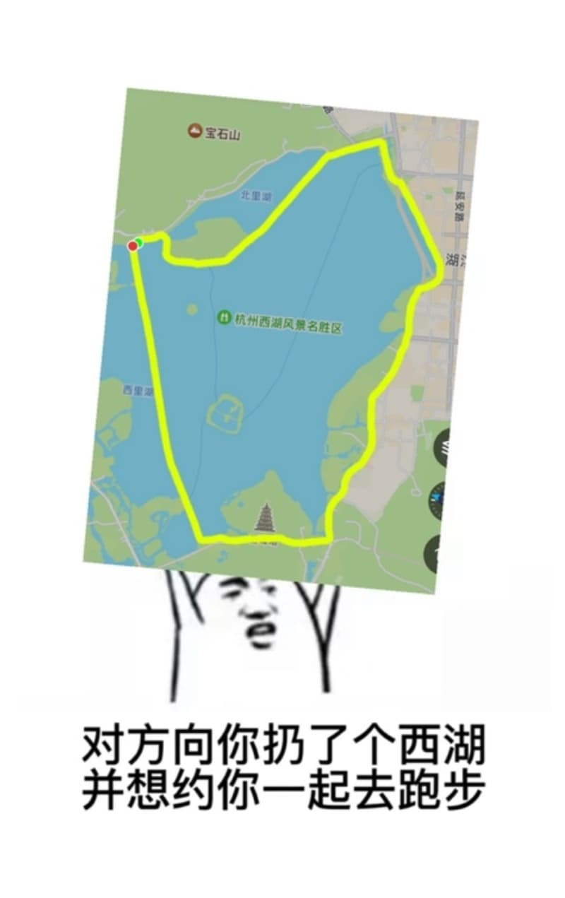

# 当村上谈跑步时，我在想些什么

————读村上春树《当我谈跑步时，我在谈些什么》有感

<b>前排提醒：本文总计4000字左右，预计用时12分钟</b>

## 我是怎么与这本书相遇的

其实说起来，这本书我在高中时已经听说过。当时的自己应该是高三吧，偶尔也会跑步。一半是学校强制性的全年级绕校园跑一圈，一半是自己在自由的时间里单独跑啊跑。关于跑步，我喜欢在没有球局的下午，在下午最后一节课之后，一个人穿过校道与去食堂的人流逆向而行，接着便是抵达操场一口气跑它个六七圈（折算下来其实也就3km左右）。

其实那时候的我们，大多是不喜欢学校这种给学生们强制性固定时间做特定活动的规章制度的，学业任务安排倒是可以理解，但是连自由运动的时间和自由也要剥夺的话，那未免实在是让人觉得不可接受。于是那时候的我们，常常喜欢在迟发的时候一个班分成四队跑的整整齐齐，但只要过了5分钟，在老师看不见的拐角之后，我们就开始放肆地进行“分子扩散运动”。正如布朗运动里一切无序杂乱的粒子一般随机游走，或慢或快，或远或近，时而奔放，时而摆烂。有时候我们能所有人并成一排在校道上压马路，有时候也能码成一个金字塔，后面汇聚了一堆闲庭信步的人———毕竟在前面领跑的人本身的速度也不快，稍微跑跑就能轻易追上。但是教导主任可没有这么傻，只在起点处设置一个老师。他会在我们整条跑步的线路上均匀地安排好几位老师轮流值班进行监督。于是我们出此下策，跑过了上一位老师100米之后，便立马放肆地进行“分子扩散”，在距离下一位老师100米之前，我们又立马进行“分子重组”“囊吞”“胞吐”，瞬间恢复到出发时一切秩序井然的样子。现在回想起来，当时的我们对于跑步的乐趣，并不在跑步本身。更多的是在于冒险以及叛逆之上。

## 我什么时候开始认真读这本书

时间过得很快，从高三一下子到了大三。三年时光就这样静静地溜走了。大一大二之后，由于宿舍离操场实在太远了，每天的锻炼基本上也就只剩下通勤路上那可怜的骑车。关于跑步，也只剩下体测时令人厌烦的1km（跑1km记录时间作为成绩）以及每学期令人闻风丧胆的12分钟（限时12分钟，记录公里数作为成绩）跑。直到大三，加入了烂诗人以后，被立哥拉进了“烂诗人周末西湖晨跑群”，我渐渐开始爱上了跑步。从一开始的5km，再到后来的10km,12km，我开始惊喜地发现原来自己可以一口气坚持这么长的距离。村上在这本书里也提到过，在长跑的整个过程中你可以确保这是你自己的沉默时间，不需要和其他人交谈，不需听他人多言，不必多加思考，只需要眺望周围的景色独处，留出时间来面对真正的自己，只有这样才能看清自己，理解自己。每次环西湖跑圈时，路形变换多端，一开始有上坡下坡，接着便是沿者景区公路穿越游客进行路跑，最后还会回到连绵起伏的苏堤。熙熙攘攘的游客擦肩而过，川流不息的车流伴你左右，虽然说你们有一群人在一起跑，但毕竟每个人跑起来的配速和节奏都不太一样，所以其实大部分时候你都是一个人跑着，自己和自己的肌肉进行对话。

## 我和这本书同频共振的地方

> “这恐怕是一种颇费功夫的性格：一个不写成文字就无法顺利思考的人，想找寻自己跑步的意义，非得动手一个字一个字写出这样的文章才行。”

村上的这番话真的说到了我心里去，这也是我为什么想写这篇文章的原因。很多时候一件事情的思绪并不清晰的时候，你其实可以选择通过文字来记载它，来还原它，当你在思考如何遣词造句，组织语言的时候，其实你的大脑已经在开始疏通你的思路。当你渐渐开始写起来之后，你会发现你的思路越来越清晰。所以我很希望能够通过这篇文章来寻找自己关于跑步的一些记忆，并且通过书写而思考，继而透过修改而深化思考。

> “持之以恒，不乱节奏，对于长期作业实在至为重要。一旦节奏得以设定，其余的问题便可以迎刃而解。”

是的，这句话对于长跑来说尤其正确。在准备一场马拉松的时候，我们往往需要在赛前堆积跑量。需要注意的是，我们需要每天都保持差不多的训练量，并且长期地执行下去。节奏，对于马拉松来说至关重要，对于长跑来说也不可忽视。其实长跑本身并不难，关键就在于你要学会和身体进行对话，找对正确的节奏，并全程保持下去。反观我们的现实生活，很多事情其实都是需要节奏的，需要有条不紊地进行安排，以此方可达成我们的目标。

> “为什么从某一刻起，我不得不“认真地”跑步了？可以举出几项理由。首先，人生逐渐变得忙碌，日常生活中无法自由地抽出时间来了。并不是说在年轻的时候，时间要多少有多少，但至少没有如此繁多的琐事。”

相信不少人其实都奔波于工作和学业之中，大大小小的事物肆意地占据了我们的时间。我时常会想，每天能抽出一定的时间出来进行日常的跑步，其实也已经很幸福了，至少我还有坚持每天做同一件事的自由。也不知道从何时起，我会把跑步当成了一个日常习惯，甚至慢慢演变为一种信仰，就好像每天的一日三餐一样习以为常。

> “在这层意义上，写小说很像跑全程马拉松，对于创作者而言，其动机安安静静、确确实实地存在于自身内部，不应向外部去寻求形式与标准。”

每一次跑步之前，我都会问我自己，我这一次要跑多远？是5km，6km，还是说脑海中那个设置好的终点呢？一旦设定好目标以后，我便不允许自己中途放弃，非得咬着牙坚持到预想中的目标方可允许自己停下来休息。我跑步，不是为了谁而跑，我只是想锤炼自己的意志力，去鞭策寄居在身体里的那个不屈的灵魂罢了。

> “我觉得作为伴跑音乐，摇滚最让人满意，像红辣椒、街头霸王、贝克乐队，或者是克里登斯清水复兴合唱团、甲壳虫之类老音乐。节奏越简单越好。”

不知道大家在慢跑的时候喜欢听什么音乐？其实我没有固定的歌单，但是我比较喜欢听乐队，喜欢告五人、新裤子、纵贯线、万能青年旅店等等。我很享受跑步的时候疾风飞翔的感觉，就好像乐队那不羁的灵魂一般，张狂而又洒脱。当然我听歌也比较杂，很多时候更喜欢随机播放，因为我永远期待未知，期待下一首歌翻飞的鼓点、抓耳的歌词以及迷人的旋律。就如我期待前方未知的风景一般，所以我选择迎风奔跑，去拥抱下一次邂逅！

> “我跑步，只是跑着。原则上是在空白中跑步。也许是为了获得空白而跑步。即便在这样的空白当中，也有片时片刻的思绪潜入。这是理所当然的，人的心灵中不可能存在真正的空白。人类的精神还没有强大到足以坐拥真空的程度，即使有，也不是一以贯之的。话虽如此，潜入奔跑着的我精神内部的这些思绪，或说念头，无非空白的从属物。它们不是内容，只是以空白为基轴，渐起渐涨的思绪。”

有时候跑着跑着，你会感觉自己慢慢进入了思想的空白期。仿佛灵魂已经从身体飘了出去，只剩下肉体如机器一般机械而有规律地往前奔跑着。这种状态通常会在你跑过了3km之后出现，你不会意识到自己又跑过了多少米，就如村上自己所说的，“我不是人，是一架纯粹的机器，所以什么也无须感觉，唯有向前奔跑。”。我想这种所谓的“空白”的感觉是很难得的，它好比一个口子开的并不大的缝，给予我们不安的灵魂一个喘息的机会。

> “这理当是十分可笑的心情，可是我连这份可笑都无法感受到了。在这里，跑步几乎达到了形而上学的领域。仿佛先有了行为，然后附带性地才有了我的存在。我跑，故我在。”

我觉得这段话很有意思，非常富有哲学性，于是便摘录了下来。村上并不认为是先有他的肉体作为物质基础，随后才产生了负载在肉体身上的跑步这一行为。恰恰相反的是，他认为是跑步构成了他的存在，是跑步构成了他这一个个体。这也不禁让我开始思考，我的本体是什么？是什么事物构成了我？我活着的意义是什么？

> “我非挑战纪录的无邪青年，亦非一架无机的机器，不过是一介洞察了自身的局限，却尽力长期保持自己的能力与活力的职业小说家。”

人类本就是一种有局限性的生物，但是人类的可贵之处正是在于拥有打破局限性的勇气和决心。就如同西西弗斯那永远也不可能抵达山顶的巨石一般，西西弗斯生命的意义不在于巨石最后抵达山顶的那一刻，而在于重复千遍万遍永不放弃的挣扎和抗争当中。村上作为一名小说家，是需要一些每天都会去做的事情来保持自己的能力与活力的，于是他选择了每天都去跑步，以此时刻提醒自己人生当中总有一件事是自己每天都会去做的，就如吃饭睡觉一样正常，这没有什么大不了的。

> “不伴随着痛苦，还有谁来挑战铁人三项赛和全程马拉松这种费时耗力的运动呢？正因为痛苦，正因为刻意经历这痛苦，我才从这个过程中发现自己活着的感觉，至少是发现一部分。”

痛苦，这个词是那么的有味道。愿意刻意去经历痛苦，以此来提醒自己还活着，那么想必此人已经到了非凡的境界。正巧我最近也在读史铁生的《我与地坛》。里面有一篇散文写的很好，叫做《好运设计》。简而言之，史铁生探讨了一个幸运的人生到底应该是怎样的？一个顺顺利利毫无缺陷的人生，或许并不是好运的，因为它在死亡面前显得那么脆弱和不堪一击，因为不可避免地走向死亡结束这完美的人生将会是它最终的宿命。倘若没有痛苦，就不会体会到什么叫做幸福。上帝是很公平的，它给我们每个人的人生都安排了一定的痛苦。面对痛苦，接受痛苦的磨练，学会认清现实并依然热爱生活，或许才是上帝的良苦用心。

> “通过跑步结识形形色色的人，也是我的喜悦之一。”

这句话说的对，放在烂诗人里说的更对。通过晨跑线我认识了不少朋友，但我觉得自己通过跑步结识的人还不算多，不算广，我想每个人对于跑步应该都会有属于自己的感受。每每环湖的时候，你能看到各种颜色的跑旗，甚至还有随风飘荡的气球。一路上你也会和不少人碰面，有看起来像学校组织的家庭版晨练，也有专业的跑团例行安排的组团训练，有一个人默默地戴着耳机兀自前行，也有两三好友相约齐头并进。随着大家逐渐阳康，我想西湖边的跑步文化一定会重新回归！

## 关于跑步，我永远不会忘记

我想我不会忘记翼德第一次来参加晨跑，依旧是一身黑色冲锋衣的他丝毫不减“超速小编”的风范。杭州的晚冬，清晨七点冷风刺骨。但出乎意料的是，他来的特别早，甚至比领队荸荠还要早。开跑之后，他一度领先荸荠，我和荸荠不得不佩服超速小编的实力。随后，我又和荸荠在路上悄悄密谋一定要在苏堤那儿把翼德给拉爆。最后很可惜的是，翼德并没有给我们机会在苏堤那儿拉爆他，因为最后三公里我们一群人早已散的七七八八，哈哈！

我想我不会忘记我第一次和小R坤坤为了日出而早起晨跑。早起晨跑之后，我很惊喜地发现我的内心收获到了意料之外的平静与安宁。早起还让我发现，自己突然之间拥有了额外的闲暇且自由安排的时间。不知道从什么时候开始，时间已经变得弥足珍贵，特别是可以自由安排的时间。那天清晨，我们遇见了粉红色的朝霞，金黄色的阳光，清新的空气，悦耳的鸟声。当一切结束之后，我们仿佛从世外桃源回归尘世，回归我们日常的车水马龙当中，此生不悔往矣！

## 对于跑步，我想说

2023年，我希望自己能保持日常的跑步量，无论如何都要做到。我想参加人生中的第一次半马和全马，希望自己能坚持带晨跑线，希望和每一位热爱跑步的朋友一起追逐每一个日出！

